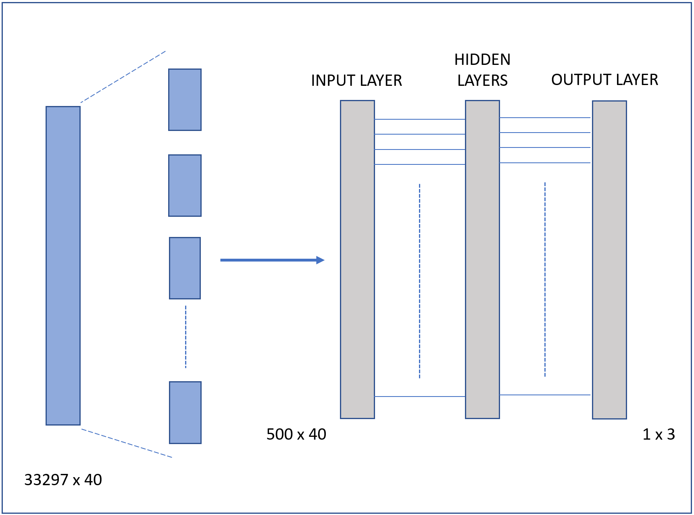

[//]: # template from: https://sylvaindeville.net/2015/07/17/writing-academic-papers-in-plain-text-with-markdown-and-jupyter-notebook/
[//1]: #  More Markdown examples: https://github.com/ulyngs/chi-2021-rmd-template/blob/master/main.Rmd

[//2]: # GOING TO TAKE THE MOST TIME: 1) Figures if we want to describe the models 2) Report text and review and revision, 3) 

[//3]: # Narrative: started with 64 --> 71 to 72 with LLM

# Introduction

The ability to write effective argumentative essays is important for student success - both academically, and peronally.  Essay writing is crucial to academic success, as it is a dependency of in-class success across History, Political Science, English, and any other subject where medium-length written responses are frequently required.  Additionally, essay writing is a common component of the college admissions process, with rejection due to a poor essay having potential to impact life-long career trajectory.

The specific act of argumentative essay writing demands skills distinct from narrative or expository writing.  Specifically - argumentative writing is a dialogic problem-solving activity between the author and the audience, two groups that may have a difference of opinion about a controversial issue[@FerrettiRalphP2019Awta].  It requires self-regulation, empathy with the audience's perspective, knowledge of the topic, and the linguistic skill to provide a coherent whole.

In the United States, students are deficient in their ability to author argumentative essays.  In a study by the National Center for Educational Statistics, U.S. Department of Education, 2011, only 27% of 8th grade students performed above the 'Basic' level in writing ability[@NCESWriting2011].  Given the current burdens already put on teachers, and in light of the ongoing teacher shortage[@espinoza_saunders_kini_darling-hammond_2018], the commensurate time investment by educators is limited.  Our goal is to investigate machine learning solutions to supplement teachers, and serve students, through more accurate automated grading of argumentative essays.

# Problem Definition

In support of achieving more accurate automated grading of argumentative essays, we focus on building a model to predict the graded effectiveness of pre-coded discourse elements of an argumentative essay.  To some extent, this scope is dictated to us by our dataset, as we do not have effectiveness labels for the entire essay, but only for these component discourse elements.

We will have available a set of English-language argumentative essay text, substrings of that text with a discourse element label, and for each discourse element, a three-class single-source expert label of effectiveness: Effective, Adequate, or Ineffective.

Here is an example of several 'Concluding Statement' discourse elements from the text, with distinct effectiveness labels.

| Text | Effectiveness     |
| :----------------------------- |    :----:   | 
| *Individual car use isn't bad. Millions of individuals using cars, however, is very bad. Note the emphasis. Even just making a concious effort to car pool, bike to work or school, use public transportation, or use some sort of alternative transportation could be enough to clear up the air of some of it's emissions, keep oneself and others happier and less stressed, save time and money, and improve their city all in one little decision. It's just a matter of going ahead and doing it, so what is stopping anyone from going out and making that change now? Be the change you want to see and limit your car usage now.* | Effective   |
| | |
| *In the end it is not possible that the mesa is an alien artifact and is instead just a butte or a mesa that happens to like a face. Because the clearer picture shows that it now looks nothing like a face, water stopped flowing on the red planet a long time ago, and Earth also has these land forms all over the place.* | Adequate | 
| | |
| *Scientest are working hard to accheve this goal to explore this harsh mystery planet. They accept the challanges that come with it and they strive to succeed not only to gain insight but to quench their curiosity that all humans have about this planet and the possibilities that it could lead to.*| Ineffective   |
|
: Sample Discourse Elements and Effectiveness Labels

Our goal is to predict, given essay text and identified discourse element text, the expert-provided discourse element effectiveness label, one of: 'Effective', 'Adequate', or 'Ineffective.'  The identification of discourse elements and assignment of these labels was done by expert graders, following a defined rubric[@KaggleFBRubric2022].  These three labels are our target classes.

Due to the imbalances across the three target classes in our data, we monitor both accuracy and  balanced accuracy when evaluating model quality.  With \begin{math}TP_l\end{math} the count of true positive predictions of each class \begin{math}l \in L=\textit{\{Effective, Adequate, Ineffective\}}\end{math}, and \begin{math}n_l\end{math} the number of discourse elements with label \begin{math}l\end{math}, we define accuracy and balanced accuracy as follows:

$$ \text{accuracy} =  \frac{\sum_{l \in L} TP_l}{\sum_{l \in L} n_l} $$ 

$$ \text{balanced accuracy} = \frac{1}{|L|} \sum_{l \in L} \frac{TP_l}{n_l} $$ 

 Essays in our data are not of predefined topics, and our model will need to handle topics not observed in the training data.

# Expert Knowledge

The distinction between an Ineffective, Adequate, and Effective discourse element, even by the rubric provided, relies on qualitative judgements of the grader.  For example, the criteria for an effective Lead element is: 

> *The introduction begins with a statistic, a quotation, a description, or some other device to grab the reader’s attention and point toward the thesis.*

When faced with identifying features, the qualitative guidance raises questions.  What constitutes, "some other device that grabs the reader's attention"?  What makes a description grab the reader's attention?  Will the same text equally grab the attention of all graders?   

To better identify the thought process of expert graders, we authored a questionnaire consisting of labeled essays randomly drawn from the dataset, stratified to represent, at least once, every effectiveness across every discourse element type[@ChildsBhatnagarAli_2022].  We distributed the questionnaire to a number of professional educators with experience teaching at the primary and secondary level, sampled by convenience. Responses were gathered, preserving anonymity, and distributed to the team for review.

| Ineffective Discourse Element | Educator Response    |
| :--------------------- |    :---------   | 
| *The study the ability of humans to read subatle changesin facial expressions, thast they appiled reverse correlation technique to reveal visual features that mediate understanding of emotion expressed by the face. Suprising finding were that (1) the noise added to test face image had profound effect on the facail expression and (2) in most every istance the new expression was meaningful. All 44 major muscles in the mode must move like human muslces. Movemment of one or more mucles is called an "action unit" Then Dr. Pual Eckam, creator of (FACS) Ekman has classified six basic emotions- happeniess, suprise, anger, disgust, feat and sadness. \[...\] The process begins whwne the computer constructs a 3-D comupter Model.* | I would suggest the evidence was graded as ineffective because it isn't in direct support of a claim. Honestly, I don't see a claim at all. This essay is really difficult to read/follow.   |
| | |Survey
| *Sometimes its kinda bad driving because the percentage of transportation is getting too high, also theres a whole bunch of drivers that are starting to find according to reuters so that caused to tthe people cars had their cars impounded for their own reaction due to the fine * | The position was graded ineffective because it isn't clear. Is the position that it's "kinda bad driving because the percentage of transportation is getting too high"? If so, the second part of this sentence should be placed elsewhere in the essay if the writer believes it's relevant to the argument. | 
| | |
| *The only way that this could be an alien artifact is if the martians are inside of it or underneath it. *| The use of the word "only" makes this ineffective as a claim. Writing in absolutes almost always gets a writer in trouble in an essay.   |
|
: Select Domain Expert Feedback

The responses are useful in identifying that if a discourse element is, "really difficult to read/follow," then a grader may be more likely to rate that element as Ineffective.  This insight led to development of the extracted sentence perplexity feature, yielding a 1% accuracy improvement, covered in greater detail below.

# Data

For this project, the dataset we are using contains more than 4161 essays in the English language. These essays are annotated for 7 discourse elements that are: (1) Lead, (2) Position, (3) Claim, (4) Counterclaim, (5) Rebuttal, (6) Evidence, and (7) Concluding Statement. 

In the plot above you can see the distribution of training examples w.r.t the discourse types. So for discourse type 'Claim' and 'Evidence', there are almost 12000 examples. For 'Position' and 'Concluding Statement', there are around 4000 examples whereas for discourse types 'Lead', 'Counterclaim', and 'Rebuttal' the number of training examples is around 2000 or below. Combining all these types there are more than 36765 total discourse texts.

These essays are rated by human readers and based on the quality of the arguments presented in each discourse, each discourse is classified into three classes that are (1) Effective, (2) Adequate, and (3) Ineffective.
In the bottom plot, you can see the distribution of training examples w.r.t the output labels. There are around 20000 examples that are labeled as Adequate, 7500 as Effective, and around 5000 examples labeled as Ineffective.

Note that the grading was done by experts, but there is an expected inconsistency in grade, even with the given rubric.  Effectiveness labeling was done by different experts with no cross sampling nor majority label analysis.

The last thing to note about the training data is that it has an uneven distribution of different discourse types as you can see in the plot below, there are a lot more examples of discourse types 'Claim' and 'Evidence' than the others. 
Also, there is an uneven distribution of class labels within the discourse types. For example for discourse type Claim, it is mostly labeled as 'Adequate' then 'Effective' and then 'Ineffective'. And it is the same trend across all other discourse types as well.

## Distribution of Train / Test & Class imbalance

Here is the target class distribution in our Train and Test dataset:

| Dataset  | Ineffective | Adequate  | Effective | Total |
| ------------- | ------------- | ------------- | ------------- | ------------- |
| Train  | 5842 (17.55%) | 18977 (56.99%) | 8478 (25.46%) | 33297 |
| Test  | 620 (17.88%) | 2000 (57.67%) | 848 (24.45%) | 3468 |

Generally, the Minority class is of critical importance in Data Science problems, and models are trained to predict that. But for this data set, the classes are ordered (ineffective < adequate < effective), and all three are essential. We have explored a few methods to tackle the Class Imbalance issue:

**Downsampling** : means training on a disproportionately low subset of the majority class examples. This technique is not best suited for this dataset as we don't have an abundance of training samples (~33k).

**Upsampling** : means replicating minority class examples to balance the dataset. For our upsampling experiments, we used a factor of 2 for Effective and 3 for Ineffective examples.

\newpage

**Focal Loss** : was first introduced by Lin et al. in Focal Loss for Dense Object Detection[@LinTsung-Yi2020FLfD]. A Focal Loss function addresses class imbalance during training. It applies a modulating term to the cross entropy loss in order to focus learning on hard misclassified examples. It is a dynamically scaled cross entropy loss, where the scaling factor decays to zero as confidence in the correct class increases. We have used a $\gamma$ value of 2 for our experiments. 

$$\ Cross\ Entropy\ Loss (prob_t)  = - log (prob_t) $$

$$\ Focal\ Loss (prob_t)  = - (1 - prob_t)^\gamma\ log (prob_t) $$

$prob_t$ is probability of the target class.

**Weighted Sampling and Weighted Loss Function** : the minority class can be weighted proportionally during mini-batch sampling and in the loss function. For our experiments we have used different class weights: [Effective: 3.93, Adequate: 1.75, Ineffective:5.69] and [Effective: 1.5, Adequate: 1, Ineffective:2]

Here is the discourse type distribution in our Train and Test dataset:

| Dataset  | Claim | Concluding Statement  | Counter-claim | Evidence | Lead  | Position | Rebuttal | Total |
| ------------- | ------------- | ------------- | ------------- | ------------- | ------------- | ------------- | ------------- | ------------- |
| Train  | 10826 (32.51%) |  3039 (9.12%) | 1613 (4.84%) | 10958 (32.91%) | 2086 (6.26%)| 3641 (10.93%)| 1134 (3.40%) | 33297 |
| Test  | 1151 (33.19%) | 312 (8.99%) | 160 (4.61%) | 1147 (33.07%) | 205 (5.91%) | 383 (11.04%) | 110 (3.27%)  | 3468 |

The distribution of discourse type did not affect our model accuracy, and the model performed evenly for each discourse type.

\newpage

# Feature Engineering

We approached feature selection through experiments and iteration on independent models, regrouping to review results and suggest further features.  Ideas for features originated from the grading metric provided to teachers, with correlation plots and aggregated counts by effectiveness rating either encouraging or discouraging feature selection.  In some cases, e.g. the count of misspelled words in a discourse element, we implemented multiple extraction methods to test the quality of extraction and replicate results to confirm model impact.

## Not in Vocabulary Count
According to the annotation scheme and rubrics, the discourse elements in the essays are not penalized for misspellings. But we found a correlation between the count of misspelled words in discourse text and effectiveness (target). Tokenizers in large language models are designed to have input representation for out-of-vocabulary (OOV) and misspelled words. Hence, we have used words corpora from NLTK (words, brown, and wordnet) to form a vocabulary /dictionary of size 346,423 and used word tokenizer from NLTK to count words not in the vocabulary. The count is normalized and used as a feature in the models.

| Effectiveness Class  | Effective  | Adequate | Ineffective |
| ------------- | ------------- | ------------- | ------------- |
| Mean (Not in Vocabulary words)  | 0.59 | 0.78 | 1.42 |

## Parts of Speech

The grading rubric, and dataset samples, indicate that identifying parts of speech counts may serve as a useful feature.  Parts of speech(PoS) are also known as lexical categories or word classes.  For example, the rubric includes guidance that, "a statistic, a quotation," supports an effective rating for the Lead element.  A statistic, in many cases, can be recognized by identification of one or more 'cardinal' parts of speech - a number in digit or written form.  Similarly, quotations in the discourse element can be identified by the count of quotation symbols.

We observe in the training set coordinating conjunctions such as *and*, *but*, *neither*, and *or* appear in well written coherent Counterclaim and Rebuttal elements.  The count of these coordinating conjuctions seems a useful feature to track, for at least a subset of our discourse elements.

To accomplish the counting of these tag types, we apply the Python NLTK tokenizer[@bird2009natural] with the default English Penn Treebank Tag library[@Santorini1990] to parse each discourse element and aggregate PoS type counts.  Additionally, the number of tags (words + symbols) can itself be tested as a feature.

However, with discourse elements averaging 28 distinct words, many of the token tags are under-represented.  To mitigate, we can combine or drop tokens of the same type to capture the feature. For example, all representations of single and double quotes can be collapsed to a 'Contains Quotation' feature.
 
## Text Perplexity
Pre-trained language models are trained on pristine text corpora with structured content and without grammatical issues and misspelled words.  The standard evaluation metric for Language Models is perplexity:

$$\ Perplexity =  \prod_{t=1}^T \left[\frac {1}{P_{LM}(x^{(t+1)}|x^{(t)},...x^{(1)})} \right] ^{1/T}$$

Perplexity is the multiplicative inverse of the probability assigned to the text by the language model, normalized by the number of words in the text. The lower the perplexity, the more probable (natural) the sentence is. We are using the Generative Pre-trained Transformer model (GPT2)[@radford2019language] to compute the perplexity score of the discourse text, and the normalized perplexity score is used as a feature.

| Effectiveness Class  | Effective  | Adequate | Ineffective |
| ------------- | ------------- | ------------- | ------------- |
| Mean (Perplexity Score)  | 157.58 | 240.87 | 297.66 |
| Median (Perplexity Score)  | 46.10 | 79.86 |  87.28 |
| Standard Deviation (Perplexity Score)  | 1357.04 | 1569.65 | 1858.54 |

# Experiments

## Bag of Embeddings (BoE)

In this model, we utilized the bag of embeddings concept to create learned embeddings of dimension 64. The idea was to leverage contextual information of the words to create a bag of embeddings. This concept has been proven very powerful for many language processing machine learning models because not only it captures the words' meanings but also captures the similarity/difference between the words. 

### Features

For BoE model we used discourse text from all seven discourse elements to build the vocabulary aka. embeddings look-up table. Only those words were added to the vocabulary that appeared at least 3 times.  

## Neural Network

In our second model, we used fully connected feed forward neural network and used extracted features (i.e. POS) as inputs to the model. The premise was that the hidden layers would learn how to combine some of the input features and would help model predict better the effectiveness of an argument. 

### Features

For the neural network model, we used parts of speech (POS) as explained above in the POS section under Feature Engineering, as our input features. Each example was encoded as one-hot vector of dimension 40 where 40 is the total number of features.  

## Large Language Models (Transformers)
The Transformer is a deep learning architecture built on attention mechanism. It weighs the interdependence a) between each position of the input and output, b) within the input sequence, and c) within the output sequence. Pre-trained transformer-based language models such as BERT, XLNet, RoBERTa, DeBERTa[@he2021debertav3], and GPT-2/3 have outperformed in various NLP tasks, including machine translation, question answering, named entity recognition, text classification, and others. Transfer learning from language models has empirically achieved competitive results while being computationally effective. Transfer learning enables machine learning models to be initialized (pre-trained) with prior knowledge and consequently trained (fine-tuned) for the downstream task. We have explored BERT, RoBERTa, and DeBERTa for our multi-class classification task and augmented these architectures with different components defined in the feature engineering section.
 
 
 
 \newpage

### Experiment Details
The following table describes the experiment settings and model hyperparameters for the best-performing model (metric: Accuracy).
  
 | Component / Hyperparameter  | Description |
 | ------------- | ------------- |
 | Input Representation  | The input text for the DeBERTa tokenizer is the concatenation of "Discourse Type",  " Discourse Text", and "Argumentative Essay" separated by special tokens (start token: [CLS], separator token: [SEP]). |
 | Input Text Length | Max token length is set to 1024, which ensures that the complete discourse text and type for all samples are represented, and a portion of the essay is covered.  |
 |  DeBERTa Representation | Output hidden states for each sub-word is fed to the Mean Pooling layer, which computes the final representation considering the Mask values. |
 |  Feed Forward Input | Input to the Feed Forward Network consisted of representation from the DeBERTa model and augmented features of normalized GPT-2 Perplexity score and Not-In-Vocabulary count using NLTK word corpora. |
 |  #Hidden Units in Feed Forward Layer | 128 |
 |  Optimizer | AdamW |
 |  Scheduler | Linear Scheduler with Warmup (500 steps) |
 |  Loss Function | Cross Entropy Loss |
 |  Batch Size | 4 |
 | #Epochs  | 5 |
 |  Learning Rate | 3e-6 |
 |  Dropout | 0.10 |
 |  Weight Decay / L2 Regularization | 0.005 |
 

\newpage

## Results

| Description  | Parameters | Training Time  | Log Loss | Balanced Accuracy | Test Accuracy  |
| ----------------- | ------------- | ------------- | ------------- | ------------- | ------------- | 
BoE | 620035 | 50.5 sec | 3.39 | - | 61% |
NN | 8803 | 4.7 sec | 0.8235 | - | 63.5% |
| BERT^[Input: Discourse Text, BERT Hidden Layers: 6] | 66.95M | 2hours 50mins | 0.777 | 56.38% | 66.70% |
| RoBERTa ^[Input: Discourse Text, Essay, RoBERTa Hidden Layers: 8, Features: Not-In-Vocabulary, Discourse Type, 2 RoBERTa models] | 193.38M | 5hours 35mins | 0.741 | 59.22% | 68.80% |
| RoBERTa ^[Input: Discourse Text, Essay, RoBERTa Hidden Layers: 6, Features: Not-In-Vocabulary, Discourse Type, 2 RoBERTa models, Weighted Loss] | 164.63M | 4hours 10mins | 0.741 | 62.61% | 65.66% |
| DeBERTa-v3 ^[Input: Discourse Type, Discourse Text, Essay, DeBERTA Hidden Layers: 12, Features: misspelled count]  | 184.03M | 6hours 3mins | 0.657 | 64.63% | 70.6% |
| DeBERTa-v3 ^[Input: Discourse Type, Discourse Text, Essay, DeBERTA Hidden Layers: 12, Features: misspelled count, cardinal numbers, proper nouns, and existential theres.]  | 184.02M | 4hours 31mins| 0.66 | 62.98% | 70% |
| DeBERTa-v3 ^[Input: Discourse Text, Essay, DeBERTa Hidden Layers: 12, Features: Not-In-Vocabulary, Discourse Type, 2 DeBERTa models, Focal Loss] | 367.66M | 10hours 35mins | 0.6814 | 59.93% | 69.98% |
| DeBERTa-v3 ^[Input: Discourse Text, Essay, DeBERTa Hidden Layers: 12, Features: Not-In-Vocabulary, Discourse Type, GPT-2 Perplexity Score] | 183.93M | 10hours 30mins | 0.6609 | 63.05% | 71.11% |
:Model Results

# Ethical Considerations

There are several important ethical consideratoins regarding the nature of these models.  We caution that all models presented are trained according to the expert-assigned effectiveness label, and any bias of those graders will be encoded in the model.  

Additionally, our models applying LLMs are subject to all risks inherent, including encoded biases and representation issues.  Our focus with this work is in achieving a high accuracy, and the models described have not been tested nor augmented to protect against discrimination, exclusion, toxicity, nor human-computer interaction harms.  The reader is recommended to review *Ethical and social risks of harm from Language Models*[@WeidingerLaura2021Easr] before adopting the models described, and certainly before deployment into production environments.

# Conclusion
This paper presents our current best-effort model for predicting 3-class grades for discourse elements in argumentative essays. We recognize this task as particularly challenging due to the subjective rubric, the reliance on a single expert coder for each essay grade, and for the fact that there are no controls over the essay topics.

Feature engineering advanced through search of features easily extractable, correlation analysis, and by leveraging input from domain experts. The misspelling feature arrived from a theory that graders may be assigning poorer grades to discourse elements based on spell error count, even though this is not specified by the rubric.  We found the count of misspelled words is in-fact a useful feature to improve our models, but it's unclear if this is a secondary-effect, e.g. misspelled word count may indicate the writer did not proof read nor revise for clarity.

Input from domain experts was valuable in leading us to include the 'text perplexity' feature.  This measure quantifies the unexpected nature of the discourse element text, which domain experts indicated results in a poor effectiveness rating.

Our baseline is simply choosing every discourse element as the most frequently appearing label: 'Adequate.'   This yields an accuracy of 57%.  Bag of embeddings and a neural net using PoS tag counts yields better than expected accuracy results, with 61% and 63.5%, respectively.   The neural net training speed lends itself well to quickly exploring additional features, and groups of features, to include.

The pre-trained transformer-based models provided between a 3-6% improvement in accuracy, with no additional features added. The cost of adoption is high training time, large model size, and reduced interpretability.

Although not represented in the results table, by applying an ensemble of our three best models, we were able to achieve a slight improvement of accuracy to 71.48%.  We believe further improvements to the model is possible, with additional feature engineering and hyperparameter tuning.

# References
